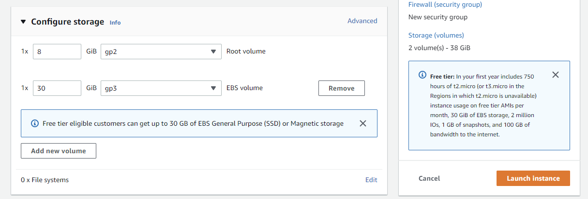

# Setup IPFS and Host Simple Benign HTML and Executable

> Austin Lai | August 22nd, 2022

---

## Table of Contents

<!-- TOC -->

- [Setup IPFS and Host Simple Benign HTML and Executable](#setup-ipfs-and-host-simple-benign-html-and-executable)
    - [Table of Contents](#table-of-contents)
    - [Description or Introduction](#description-or-introduction)
        - [Learn how IPFS works](#learn-how-ipfs-works)
        - [IPFS Setup Environment](#ipfs-setup-environment)
    - [Setup IPFS in AWS Environment](#setup-ipfs-in-aws-environment)
        - [Create EC2 Instance in AWS](#create-ec2-instance-in-aws)
        - [Setup IPFS](#setup-ipfs)
            - [Publishing IPNS](#publishing-ipns)

<!-- /TOC -->

## Description or Introduction

<!-- Description -->

What is IPFS?

IPFS ([the InterPlanetary File System](https://docs.ipfs.tech/concepts/what-is-ipfs/)) is a peer-to-peer hypermedia distribution protocol addressed by content and identities.

IPFS also a **distributed file system** for storing and accessing files, websites, applications, and data that seeks to connect all computing devices with the same system of files. In some ways, this is similar to the original aims of the Web, but IPFS is actually more similar to a single BitTorrent swarm exchanging Git objects.

<br>

### Learn how IPFS works

To learn more about how IPFS works, explore the following resources:

- Refer to <https://github.com/ipfs/ipfs>
- [IPFS Docs: How IPFS Works](https://docs.ipfs.tech/concepts/how-ipfs-works)
- [IPFS Specifications](https://github.com/ipfs/specs)

<br>

### IPFS Setup Environment

IPFS from <https://docs.ipfs.tech/concepts/what-is-ipfs/#decentralization> can be installed and host in below environment:

- Local device
- Virtual Machines
- Cloud environment (AWS, GCP, and etc.)
- Free services such as <https://nft.storage/files/> and <https://web3.storage/>, **BEWARE!!! ALL DATA UPLOADED TO FREE SERVICES WILL BE PERMANENT AVAILABLE TO PUBLIC!!!**

For this example, we are going to setup IPFS in AWS environment. If you are familiar with AWS environment, you may skip [Create EC2 Instance in AWS](#create-ec2-instance-in-aws) and refer to [Setup IPFS](#setup-ipfs).

<!-- /Description -->

<br>

## Setup IPFS in AWS Environment

### Create EC2 Instance in AWS

Go to <https://aws.amazon.com/free/> and sign-up with free account.

Once done, go to "EC2".


Then in the dashboard, select "Launch Instance"


Next, carefully check if you select "Free-Tier" Ubuntu Server OS.


Next, "Generate SSH Key".


Then, go to "Network Setting".

Setup Security Group Rule to allow SSH access from your public IP instead of open-up with "0.0.0.0/0"


Then we add 2 new security group rules as below:


**Remember to provide informative naming to the rules.**

Before proceed to create the instance, we can add additional volume to the instance since free tier given 30GB for the allowance of storage.



Now, we are good to go to create the instance with above configuration.

Once, it is up and running; we are good to proceed next step, you may connect to the instance via SSH:

```bash
ssh -i ipfs.pem ubuntu@ec2-x-x-x-x.us-xxxx-2.compute.amazonaws.com
```

### Setup IPFS

Go to <https://dist.ipfs.tech/#go-ipfs> to get the latest IPFS binary available.

To install IPFS in the SSH session, you can use the following commands:

```bash
wget https://dist.ipfs.tech/kubo/v0.14.0/kubo_v0.14.0_linux-amd64.tar.gz
tar xvfz kubo_v0.14.0_linux-amd64.tar.gz
rm kubo_v0.14.0_linux-amd64.tar.gz 
cd kubo
sudo bash ./install.sh
```

Next, setup directory for IPFS and initialize IPFS with the following:

```bash
echo 'export IPFS_PATH=/data/ipfs' >> ~/.bash_profile
source ~/.bash_profile
sudo mkdir -p $IPFS_PATH
sudo chown ubuntu:ubuntu $IPFS_PATH
ipfs init -p server
ipfs config Datastore.StorageMax 8GB

# Configure IPFS to allow direct access to the instance's gateway
ipfs config Addresses.Gateway /ip4/0.0.0.0/tcp/8080
```

Then, we create IPFS services as below:

```bash
sudo bash -c 'cat >/lib/systemd/system/ipfs.service <<EOL
[Unit]
Description=ipfs daemon
[Service]
ExecStart=/usr/local/bin/ipfs daemon --enable-gc
Restart=always
User=ubuntu
Group=ubuntu
Environment="IPFS_PATH=/data/ipfs"
[Install]
WantedBy=multi-user.target
EOL'
```

And then enable IPFS and start the service:

```bash
sudo systemctl daemon-reload
sudo systemctl enable ipfs.service
sudo systemctl start ipfs
sudo systemctl status ipfs
```

Once, the IPFS service is running; we can use command below to check the IPFS peers:

```bash
ipfs swarm peers
```

We have now created a EC2 instance with Ubuntu Server, installed IPFS on it, and started running IPFS daemon.

We can opened up IPFS gateway by browse to its address in a browser, <http://ec2-xx-xxx-xxx-xx.us-xxxx-2.compute.amazonaws.com:8080/ipfs/HASH-KEY>.

We should be able to view the IPFS default pinning files:


Then, we can try to host multi-page sites from <https://docs.ipfs.tech/how-to/websites-on-ipfs/multipage-website/#multi-page-website>

Once, we reach to the step of **Add files to IPFS**, we can use command below to add files since the guide using "IPFS Desktop".

```bash
cd multi-page-first-step
ipfs add -r .
```

Once done, we may visit to the site where the HASH-KEY provided when you add files to IPFS.


<br>

#### Publishing IPNS

Using CIDs to get content is great; it means that the user always gets the content that they want. But what if the user doesn't know what they're looking for and just wants the latest version of that content? This is where **IPNS** comes in handy.

Instead of sharing the CID of the website, we publish the root CID of the website to IPNS and then share the key we get from IPNS.

```bash
ubuntu@ip:cd multi-page-first-step

ubuntu@ip:~/multi-page-first-step$ ipfs add -r .
added Qme17nwco6bCWzhxfnxure59nqsVjvZkip4bCTW5XBovJe multi-page-first-step/about.html
added QmSydH6jDbDMxj9F9YZmBtD5TKpgZNM5P1LXkkK83fQimz multi-page-first-step/index.html
added QmW8U3NEHx3p73Nj9645sGnGa8XzR43rQh3Kd52UKncWMo multi-page-first-step/moon-logo.png
added QmYk417i1HxpHirBS79vZsbLJNpqQhMzEELpgkGAAXajRu multi-page-first-step/screen.exe
added QmSYaaaVKea6bbbgzW4bg6x5viJJYwsDLqcHksUo59PM4q multi-page-first-step

ubuntu@ip:~/multi-page-first-step$ ipfs name publish /ipfs/QmSYaaaVKea6bbbgzW4bg6x5viJJYwsDLqcHksUo59PM4q
Published to k51qzi5uqu5dhvou4mt0gs95jht2pstdq9qmz098iodly6gcp2b7pob7wb33g3: /ipfs/QmSYaaaVKea6bbbgzW4bg6x5viJJYwsDLqcHksUo59PM4q

ubuntu@ip:~/multi-page-first-step$
```

The `k51qzi...` is the IPFS installation's key! This is what we can use to point people to the content.

We should now be able to view it by going to `http://ec2-xx-xxx-xxx-xx.us-xxxx-2.compute.amazonaws.com:8080/ipns/k51qzi....`. Replace `k51qzi...` with the output from the previous step.


**Whenever you make any changes to your project, simply re-add your content to IPFS and publish it to IPNS**

<br />

---

> Do let me know any command or step can be improve or you have any question you can contact me via THM message or write down comment below or via FB
